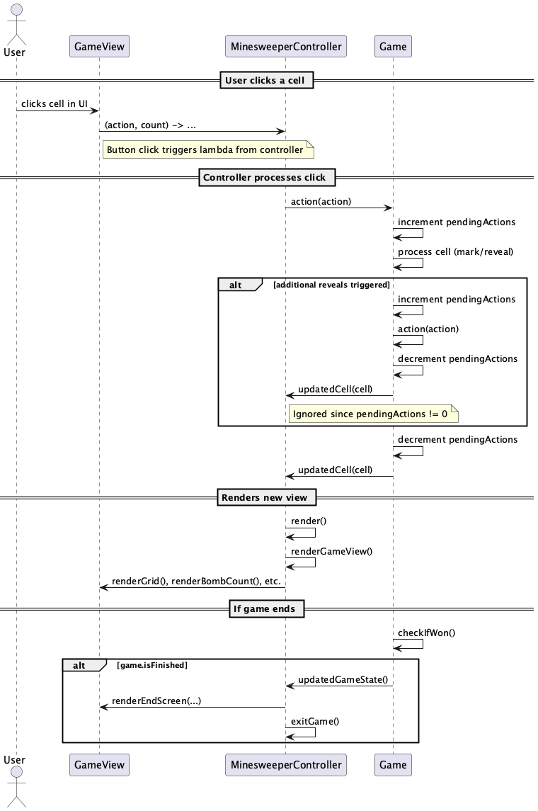

# Minesweeper

## Hvordan kjøre
- Ha siste/nylig versjon av java installert
- Installer maven (mvn)
- Sjekk at `storage` mappen eksisterer i roten av programmet, hvis ikke, så opprett den
- Kjør `mvn javafx:run` in roten av prosjektet (mac)

## Beskrivelse av appen

> **Note**
> Appen følger de samme reglene som vanlig minesweeper:
> - Spillet består av et rutenett hvor noen ruter er bomber
> - Hvis du tror en rute er en bombe, så kan du markere den med et flagg
> - Dette vil automatisk dekrementere 'Bombs left' uavhengig om det faktisk er en bombe
> - Hvis du tror en rute ikke er en bombe, så kan du reveale den
> - Hvis den ikke er en bombe vil den vise antall bomber som den naboer til (inkludert diagonalt)
> - Hvis den er en bombe så vil du tape
> - Du vinner når du har markert eller revealet alle ruter uten å treffe en bombe

Når du først launcher appen vil du måtte velge et brett, dette er selve brettet du spiller på, altså antall ruter, og hvor bombene er. Du må deretter velge et spill på dette brettet, som er et forsøk på å vinne brettet, altså en liste med aksjoner (reveal/mark) du har tatt på det valgte brettet. Når du oppretter et brett vil det automatisk lagres som et heltall, den vil velge det eksisterende brettet med det høyeste tallet (0 hvis ingen eksisterer) + 1. Når du oppretter et spill vil det automatisk lagres som det tidspuktet du opprettet spillet på Det er ikke noe ui for å slette verken brett eller spill (fikk ikke tid), men spill slettes automatisk etter de er ferdigspilt (tap eller seier).

### MVC
Under ser du hvordan model, view og controller interagerer med hverandre

## Mappestruktur

### Storage
- Programmet bruker `storage` mappen for å lagre tilstand
- Det er viktig at denne mappen eksisterer når programmet kjøres, ellers krasjer det
- Hvert Board har en egen mappe som består av et tall/id i stigende rekkefølge
- Inne i denne mappen ligger det en `board.bin` fil som inneholder layouten til Boardet
- Det ligger også eventuelle Games som spilles på Boardet i denne mappen
- Hvert game er på følgende format `{date}.bin`, hvor date er datoen når Gamet ble opprettet

### Src
- All kildekoden ligger her
- I `test` mappen ligger alle testene
- I `main` mappen ligger all koden for selve programmet
- I `main` mappen er det en `java` mappe for java koden, og en `resources` mappe for ressurser som bilder og xml for ui

